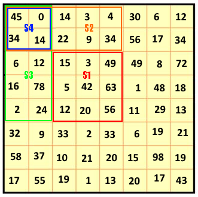
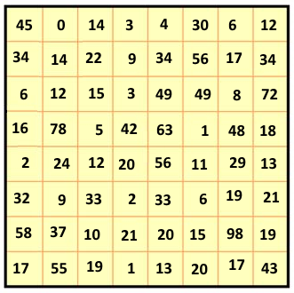
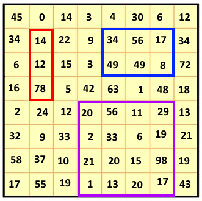

# Find Sub-Matrix Sum
For a given matrix, find the sum of any sub-matrix in O(1)

# The Algorithm
In order to calculate the sum in O(1) we will do the following pre-processing:
for each cell (x,y) we will caclulate the sum S(x,y) as the sum of the sub matrix starting with (0,0) up to (x,y).

Then the sum S of the sub matrix (x1,y1)-(x2,y2) is:
```javascript
S = S(x2,y2) - S(y1-1,x2) - S(y2, x1-1) + S(y1-1, x1-1)
```

This is illustrated in the following image:



```javascript

// Let S5 be S(4,4)  -- The sum of the sub-matrix that cell (4,4) is it's lower-right cell

S1 = S5-S3-S2+S4  // We add S4 because we subtracted it twice (in S3 and S2)
```

## Example
Given the following matrix:



Calculate the following sub matrixes 



# The Output
The output of the code is:

```javascript
Started...
Building and processing matrix.
Matrix
    45     0    14     3     4    30     6    12
    34    14    22     9    34    56    17    34
     6    12    15     3    49    49     8    72
    16    78     5    42    63     1    48    18
     2    24    12    20    56    11    29    13
    32     9    33     2    33     6    19    21
    58    37    10    21    20    15    98    19
    17    55    19     1    13    20    17    43
Sum Matrix
    45    45    59    62    66    96   102   114
    79    93   129   141   179   265   288   334
    85   111   162   177   264   399   430   548
   101   205   261   318   468   604   683   819
   103   231   299   376   582   729   837   986
   135   272   373   452   691   844   971  1141
   193   367   478   578   837  1005  1230  1419
   210   439   569   670   942  1130  1372  1604

Red rectangle [1,1 => 1,3] sum is 104
Blue rectangle [1,4 => 2,6] sum is 125
Purple rectangle [3,4 => 7,6] sum is 381
Completed.
```
